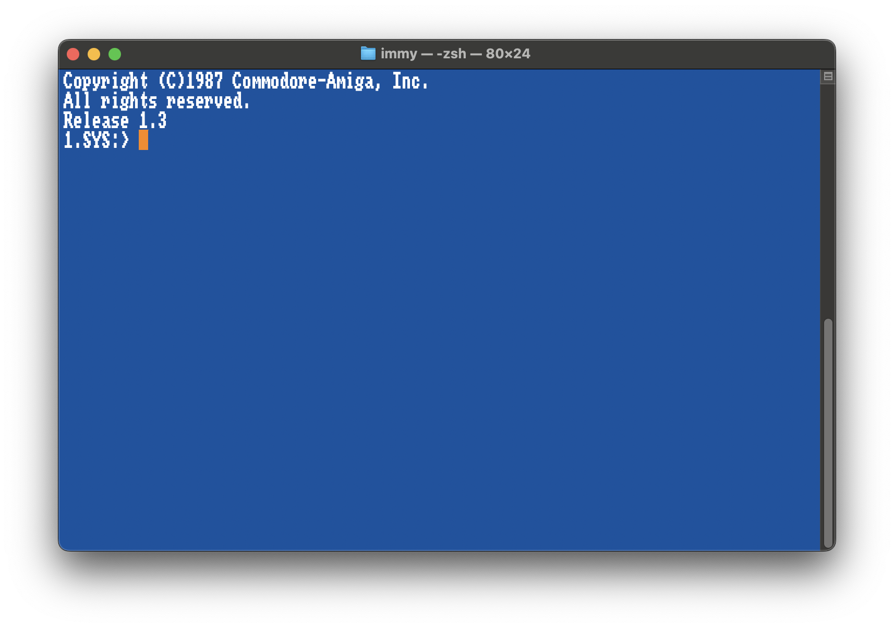
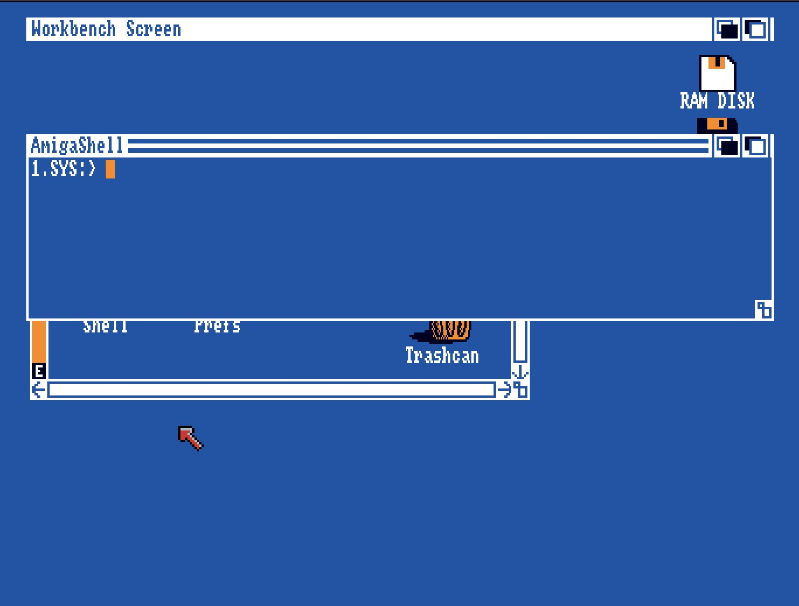
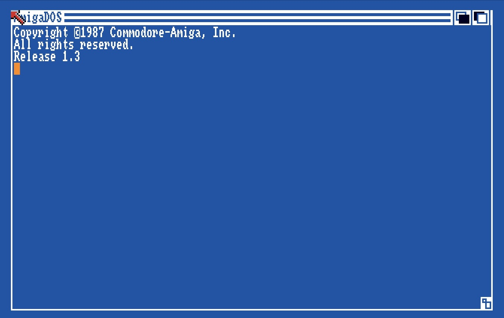

# AmigaShell styling for macOS Terminal

This setup recreates an AmigaShell style command line in macOS Terminal using the Topaz font, a custom Terminal profile, and a small shell banner.

## Result

New Terminal windows will:
- use an `AmigaShell` profile
- display the `TopazUnicodeKS13` font
- show a classic Amiga blue background
- print a Kickstart style startup banner
- use the prompt `1.SYS:> ` at home, or `1.SYS:path/to/dir> ` when navigating

## Screenshots

This setup is based on two original Amiga references and one modern macOS recreation:
- a macOS Terminal recreation using this setup
- an original Workbench `AmigaShell`
- an original Kickstart 1.3 startup screen

### macOS Terminal recreation



### Original Workbench `AmigaShell`



### Original Kickstart 1.3 startup



## Requirements

- macOS Terminal.app
- `zsh` shell
- Topaz Unicode font

**Font source**

- https://gitlab.com/Screwtapello/topaz-unicode

Install the font in Font Book, then select `TopazUnicodeKS13` in Terminal.

## 1. Create the Terminal Profile

### Option A: Import the profile file (easiest)

A pre-built Terminal profile is included in this repo.

1. Double-click `AmigaShell.terminal` — Terminal will import it automatically.
2. Open `Terminal` -> `Settings` -> `Profiles`, select `AmigaShell`, and click `Default` if you want all new Terminal windows to use it.

### Option B: Create the profile manually

1. Open `Terminal` -> `Settings` -> `Profiles`.
2. Duplicate a simple profile such as `Basic`.
3. Rename the new profile to `AmigaShell`.
4. In the `Text` tab, set:
   - Font: `TopazUnicodeKS13`, size `18`
   - Antialiased text: `off`
   - Background color: `#20519C`
   - Cursor color: `#EE8C3E`
   - Selection color: `#ED8C3D`
5. Set the cursor type to `Block`.
6. Click `Default` if you want all new Terminal windows to use this profile.

## 2. Configure the Startup Banner

Edit `~/.profile` using one of the following versions.

Open the file with:
```sh
open -e ~/.profile
```

### Option A: `(C)` version
```sh
if [ -t 1 ]; then
  clear
  echo "Copyright (C)1987 Commodore-Amiga, Inc."
  echo "All rights reserved."
  echo "Release 1.3"
fi
. "$HOME/.cargo/env"
```

### Option B: copyright symbol version
```sh
if [ -t 1 ]; then
  clear
  echo "Copyright ©1987 Commodore-Amiga, Inc."
  echo "All rights reserved."
  echo "Release 1.3"
fi
. "$HOME/.cargo/env"
```

Choose whichever banner style you prefer.

## 3. Make zsh Load `.profile`

macOS Terminal commonly starts `zsh`, so make sure `~/.zprofile` loads `~/.profile`.

Open the file with:
```sh
open -e ~/.zprofile
```

Add:
```sh
if [ -r "$HOME/.profile" ]; then
  . "$HOME/.profile"
fi
```

## 4. Set the Prompt

Open `~/.zshrc`:
```sh
open -e ~/.zshrc
```

Set the prompt to:
```sh
setopt PROMPT_SUBST
PROMPT='1.SYS:${${PWD/#"$HOME"}##/}> '
```

This shows `1.SYS:> ` when you are in your home directory, and updates to show the current path as you navigate — for example `1.SYS:Documents/Projects> `. Paths inside your home directory are shown relative to it, matching the Amiga convention of `SYS:` as the root volume.

## 5. Verify

Open a new Terminal window. You should see:
- the `AmigaShell` profile
- the Topaz font
- the blue background
- the startup banner
- the prompt `1.SYS:> ` (updating to show the current path as you navigate)

## Files Used

- `AmigaShell.terminal` — importable Terminal profile (included in this repo)
- `~/.profile`
- `~/.zprofile`
- `~/.zshrc`
- `~/Library/Preferences/com.apple.Terminal.plist`
